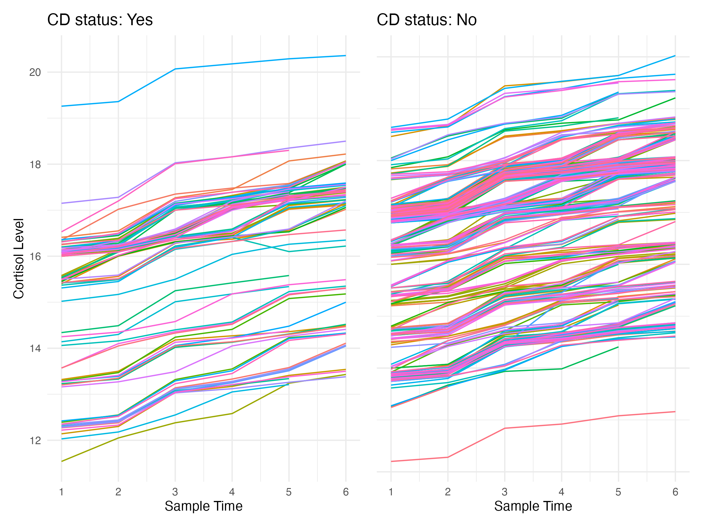
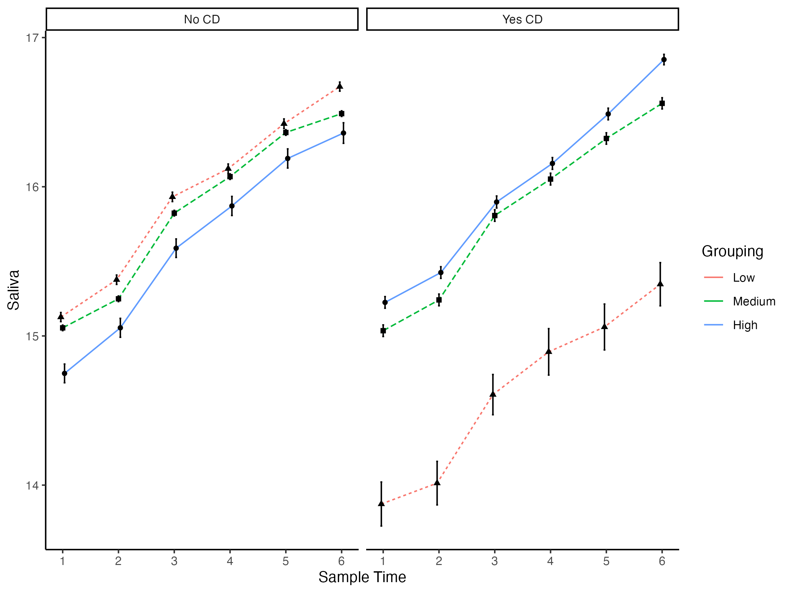

# team-5-project

> This is a Team 5 project. We aimed to investigate the effect of conduct disorder on children's cortisol trajectories. Furthermore, how different levels of callous-unemotional traits with conduct disorder will affect the cortisol trajectories. To this end, we extracted measurements of the conduct disorder, callous-unemotional traits, and children's reactive cortisol levels from the Children's Experiences and Development Study (Jaffee et al., 2015). Multilevel models were used to analyse the data.

# **Introduction**

Cortisol is a stress hormone, which is important in regulating stress responses, blood pressure, and sleep-wake cycle.

Conduct disorder (CD) is diagnosed when children exhibit an ongoing pattern of aggression towards others, and serious violations of rules and social norms. Callous-unemotional traits (CU traits) are a subtype of CD, characterised by a lack of remorse or guilt and empathy, and are unconcerned with performance at school or work.

A low baseline cortisol has been suggested to be an indicator of poor alertness for environmental risk, which has drawn interest as a potential mechanism associated with behavioural issues in children (Shoal et al., 2003). The low cortisol level may generate unpleasant sensations and motivate the child to seek stimulation, which can be achieved through antisocial behaviour (Figueiredo et al., 2020). Aggressive behaviour in children could reflect a general lack of awareness of the external environment and may be linked with a dysregulated cortisol level.

Previous studies have found a relatively consistent significant association between people with CD and their low cortisol levels. However, the direction of the association is not clear. In a systematic review conducted by Figueiredo et al. (2020), they suggested that out of 13 studies reporting a relationship between reactive cortisol level (i.e. cortisol reactivity towards a stressor) and externalising problems, six studies found a low cortisol level associated with externalising problems. Shoal et al. (2003) conducted a longitudinal study and found a similar result. They suggested that low cortisol level in the preadolescence period was a predictor for aggressive behaviour 5 years later, including low harm avoidance, low self-control, and more aggressive behaviour. However, a smaller number of studies have found a higher cortisol level in children with CD (Figueiredo et al., 2020). This may be due to the difference in the methods used to elicit stress in the participants. For example, some studies have used a public speech task, while others used social stressors. Another explanation may be linked to the time of cortisol measurements. For example, the morning cortisol after waking is higher than the cortisol level collected during the day. There has not been a definite explanation for the mixed results.

Adding on another level of complexity with CU traits, research has shown differences in people's cortisol levels when they have CD with CU, or CD only. Loney et al. (2006) have found that for male participants only, males with CU-only had a significantly lower cortisol level than males with CD-only. Although CU-only was also lower than CD combined with CU, the comparison did not reach a significant level. Interestingly, CD-only males were not associated with cortisol abnormalities and their cortisol levels were similar to controls'. These results show a pattern worth investigating the association between CD combined with CU and cortisol levels, and the cortisol levels may be affected by the severity of the CU. However, participants in this study only provided one saliva sample, which may have had issues with the bias of a single reading.

Given the mixed results for the relationship between CD, CU, and cortisol levels, and limited research using multiple measurements of cortisol levels, our group aimed to understand how cortisol trajectories may differ for people with and without conduct disorder. Furthermore, how cortisol trajectories may differ for people with CD but with different levels of CU traits.

Hypotheses:

-   People with conduct disorder will differ from those without in the cortisol level over time.

-   People with a CD diagnosis and a higher level of CU traits will differ from those without a CD diagnosis and a lower level of CU traits in the cortisol level over time.

# Methods

**Participants**

Four hundred children were recruited from the National Evaluation of Sure Start's study. Children were first seen at the age of 3, and followed up at the age of 8 to 10.

**Measures** The Inventory of Callous-Unemotional Traits (ICU) -- 24-item questionnaire designed to provide an assessment of callous unemotional traits. This has three subscales: Callousness, Uncaring and Unemotional. The dataset used the Caregiver (Parent) report version of the questionnaire.

The rating scale for items is on a 4-point Likert scale ranging from 0 (not at all true) to 3 (definitely true) -- includes certain reverse coded items. A list of the items can be seen in the X file.

**Procedure**

Cortisol level: cortisol was assessed from saliva samples, which were collected 20 minutes and 10 minutes prior to the Social Provocation Task, at the end of the task, and 20, 45, 60 minutes following the end of the task. The 7th saliva sample was collected before bedtime. At least 1 ml of passive drool was collected from participants.

Social Provocation Task: the task lasted for approximately minutes. Children were told they were going to play a video game against an opponent, who was actually a confederate. The task intended to provoke anger, frustration, and embarrassment in children. Children were instructed to undergo a practice round and two competitive rounds. Children were required to move the cursor to a target on the screen as quickly and accurately as possible. The practice round was designed so that the children performed poorly. The competitive rounds were designed so that the opponent always scored more points than the child could score in the previous rounds. Each round including the practice round finished with derogatory comments about the child's poor performance.

Children and parents were debriefed at the end of the study, but children were unaware that the game was manipulated.

# **Analyses**

We removed the seventh time point because of a lot of missing data. Participants that did not have a cortisol score for each of the six time points were removed from analyses.

**Hypothesis 1**

We wanted to control for the dependency that arises from having repeated saliva samples, we thus used a linear mixed effects model. The dependent variable was the cortisol levels (numeric), the independent variables was CD status (contrast-coded, 0-1) and Time was polynomial contrast coded. This choice was made because Time is ordinal and equally spaced. A random effect of participant ID was included in the model. The final model was: [Cortisol \~ Time \* CD + (1\|ID)]. Figure X shows change over time (Time 1 to 7) and condition.

The main effect of Time (F(5, 312054.08) = 625894.279, p<.001) and the interaction between Time and Conduct Disorder Status (F(5, 312054.08) = 79.595, p<.001) were significant. The main effect of Conduct Disorder status was non-significant (F(1, 390.12) = 0, p = 0.9949). Table 1 shows the results in terms of the individual contrast-coded predictors.

**Hypothesis 2**

We used a linear mixed effects model. We focused on the subset of the sample in the CD condition. We constructed two models; both of whuch had the same dependnet varibale - Cortisol levels. In Model 1, the independent variable was only Time [Cortisol \~ Time + (1\|ID)]. In Model 2, the indpeendent variables were Time, Callous-Unemotional traits Grouping (contrast-coded, refer to contrast codes in Table X) and their interaction [Cortisol \~ Time \* Grouping + (1\|ID)]. Figure X shows change over time (Time 1 to 7) and CU grouping.

Model 1: The main effect of Time was significant (F(5, 69030) = 195877, p<.001), suggesting that cortisol levels change over time. 

Model 2: The main effect of Time was significant (F(5, 69020.004) = 57381.5071, p<.001) and the interaction with grouping (F(10, 69020.012) = 154.1561, p<.001). The main effect of grouping was non-significant (F(2, 81.985) = 0.9976, p = 0.3732). Table 2 shows the results in terms of the individual contrast-coded predictors. Model comparison using anova() showed that Model 2 was significantly better, and we thus retain this.

# Discussion

H1: The relationship between Cortisol levels and CD Status involves changes in direction over time. Individuals with no CD status have greater linear increase of cortisol score over time. Individuals with CD status cortisol changes at a faster rate and have more changes in curvature.

H2: Having low, medium or high CU traits affects the trajectory of cortisol levels.

**Limitations/ Future Research** 

Future research can also consider gathering resting-state cortisol to gain a more complete understanding of the cortisol trajectories. This is because previous literature has suggested that resting-state cortisol is not as subjective to individual differences in immediate reaction towards novel stressors, compared to task-based cortisol (Shoal et al., 2003). Specifically, Shoal et al. (2003) have suggested that the cortisol sample collected at the end of the task could be used as an index of resting-state cortisol level. This was because people had passed the anticipation phase and the stressors were no longer novel, which led to a lower and more habituated cortisol concentration. However, this method may depend on the task used, for example, children in the present study were still provoked by the opponents by the derogatory comments at the end of the task, which would continuously affect cortisol levels. Nevertheless, it might still be useful for future research to collect resting-state cortisol by collecting morning saliva samples.

Furthermore, while this study used multiple measures of cortisol sample and can be considered longitudinal, it was nevertheless a short period. It did not provide information about the cortisol trajectories beyond one day. Future research could include cortisol measures that last for a longer period to see if there will be a greater between-group variation in the cortisol development, and potentially any predictive power of the cortisol development to future behavioural changes.
